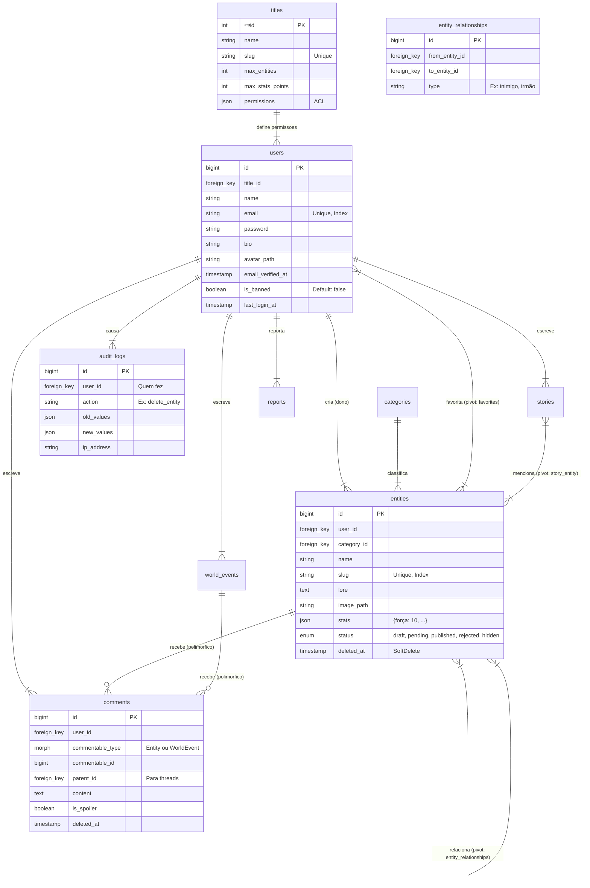

## Banco de dados

## 📑 Sumário
- [MER](#-Modelo-entidade-relacionamento)
- [Dicionario de dados user](#-)
- [Dicionario de dados ](#-)
- [Dicionario de dados ](#-)
- [Dicionario de dados ](#-)
- [Dicionario de dados ](#-)
- [Dicionario de dados ](#-)
- [Documetação](../README.md)

---

<!-- 

|o	o|	0/1
||	||	1/1
}o	o{	0/n
}|	|{	1/n

-->

## Modelo entidade relacionamento

## 📕 Dicionário de Dados

## 
| Coluna | Tipo | PK/FK? | Obrigatório? | Descrição |
| :--- | :--- | :---: | :---: | :--- |
| `id` | INT | **PK** | Sim | Identificador único auto-incremento. |
| `name` | VARCHAR(100) | | Sim | Nome completo do usuário. |
| `email` | VARCHAR(255) | | Sim | Deve ser único no sistema. |
| `role_id` | INT | **FK** | Sim | Referência à tabela `roles`. |
| `created_at` | DATETIME | | Não | Data de criação do registro. |
