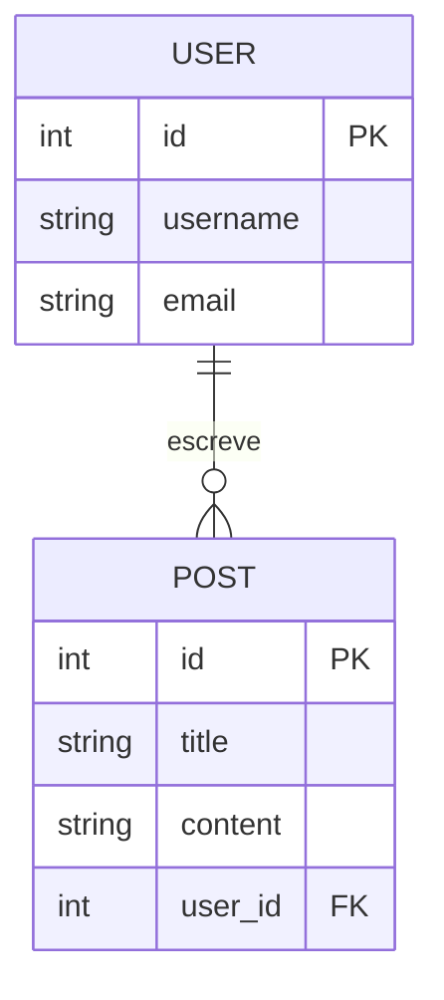

### Tabela: Usuários (users)
Armazena os dados de login e perfil.

| Coluna | Tipo | PK/FK? | Obrigatório? | Descrição |
| :--- | :--- | :---: | :---: | :--- |
| `id` | INT | **PK** | Sim | Identificador único auto-incremento. |
| `name` | VARCHAR(100) | | Sim | Nome completo do usuário. |
| `email` | VARCHAR(255) | | Sim | Deve ser único no sistema. |
| `role_id` | INT | **FK** | Sim | Referência à tabela `roles`. |
| `created_at` | DATETIME | | Não | Data de criação do registro. |

