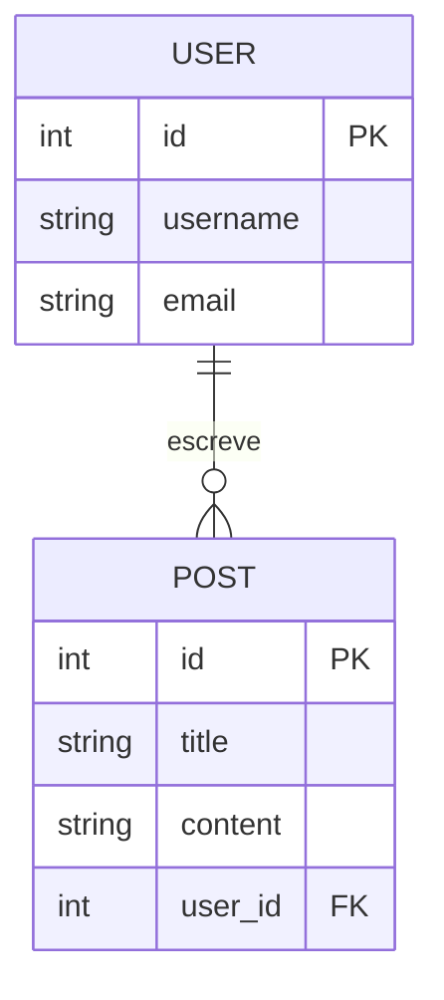

```mermaid
erDiagram
    USER ||--o{ POST : "escreve"
    USER {
        int id PK
        string username
        string email
    }
    POST {
        int id PK
        string title
        string content
        int user_id FK
    }
```
