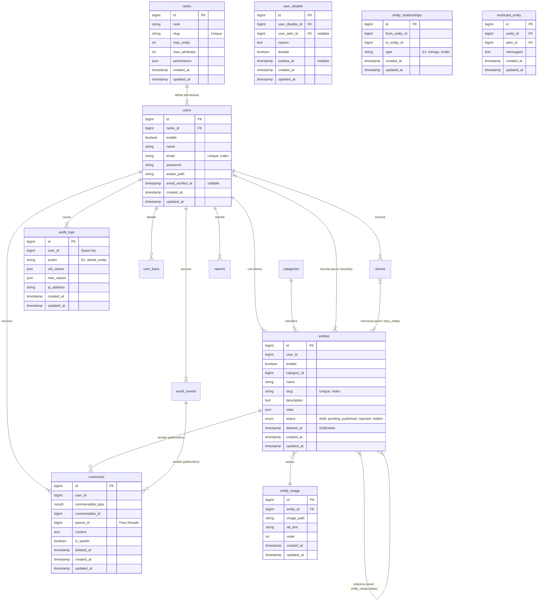

## Banco de dados

## 📑 Sumário
- [MER](#-Modelo-entidade-relacionamento)
- [Dicionario de dados user](#-)
- [Dicionario de dados ](#-)
- [Dicionario de dados ](#-)
- [Dicionario de dados ](#-)
- [Dicionario de dados ](#-)
- [Dicionario de dados ](#-)
- [Documetação](../README.md)

---

<!-- 

|o	o|	0/1
||	||	1/1
}o	o{	0/n
}|	|{	1/n

-->

## Modelo entidade relacionamento

```mermaid
erDiagram
    ranks ||--|{ users : "define permissoes"
    users ||--|{ entities : "cria (dono)"
    categories ||--|{ entities : "classifica"
    users ||--|{ comments : "escreve"
    users ||--|{ audit_logs : "causa"
    users ||--o{ user_bans : "banida"
    
    entities ||--o{ comments : "recebe (polimorfico)"
    world_events ||--o{ comments : "recebe (polimorfico)"
    
    entities }|--|{ entities : "relaciona (pivot: entity_relationships)"
    users }|--|{ entities : "favorita (pivot: favorites)"
    entities }o--|| entity_image : "possui"
    
    users ||--|{ world_events : "escreve"
    users ||--|{ stories : "escreve"
    stories }|--|{ entities : "menciona (pivot: story_entity)"
    users ||--|{ reports : "reporta"

    ranks {
        bigInt id PK
        string rank
        string slug "Unique"
        int max_entity
        int max_attributes
        json permissions
        timestamp created_at
        timestamp updated_at
    }

    users {
        bigInt id PK
        bigInt ranks_id FK
        boolean enable
        string name
        string email "Unique, Index"
        string password
        string avatar_path
        timestamp email_verified_at "nullable"
        timestamp created_at
        timestamp updated_at
    }

    user_disable {
        bigInt id PK
        bigInt user_disable_id FK
        bigInt user_adm_id FK "nullable"
        text reason
        boolean disable
        timestamp expires_at "nullable"
        timestamp created_at
        timestamp updated_at
    }

    entities {
        bigInt id PK
        bigInt user_id
        boolean enable
        bigInt category_id
        string name
        string slug "Unique, Index"
        text description
        json stats 
        enum status "draft, pending, published, rejected, hidden"
        timestamp deleted_at "SoftDelete"
        timestamp created_at
        timestamp updated_at
    }

    entity_image {
        bigInt id PK
        bigInt entity_id FK
        string image_path
        string alt_text
        int order
        timestamp created_at
        timestamp updated_at
    }

    entity_relationships {
        bigInt id PK
        bigInt from_entity_id
        bigInt to_entity_id
        string type "Ex: inimigo, irmão"
        timestamp created_at
        timestamp updated_at
    }

    restricted_entity{
        bigInt id PK
        bigInt entity_id FK
        bigInt adm_id FK
        text mensagem
        timestamp created_at
        timestamp updated_at
    }

    comments {
        bigInt id PK
        bigInt  user_id
        morph commentable_type 
        bigint commentable_id
        bigint parent_id "Para threads"
        text content
        boolean is_spoiler
        timestamp deleted_at
        timestamp created_at
        timestamp updated_at
    }

    audit_logs {
        bigInt id PK
        bigInt user_id "Quem fez"
        string action "Ex: delete_entity"
        json old_values
        json new_values
        string ip_address
        timestamp created_at
        timestamp updated_at
    }

    
```

## 📕 Dicionário de Dados

## 
| Coluna | Tipo | PK/FK? | Obrigatório? | Descrição |
| :--- | :--- | :---: | :---: | :--- |
| `id` | INT | **PK** | Sim | Identificador único auto-incremento. |
| `name` | VARCHAR(100) | | Sim | Nome completo do usuário. |
| `email` | VARCHAR(255) | | Sim | Deve ser único no sistema. |
| `role_id` | INT | **FK** | Sim | Referência à tabela `roles`. |
| `created_at` | DATETIME | | Não | Data de criação do registro. |
